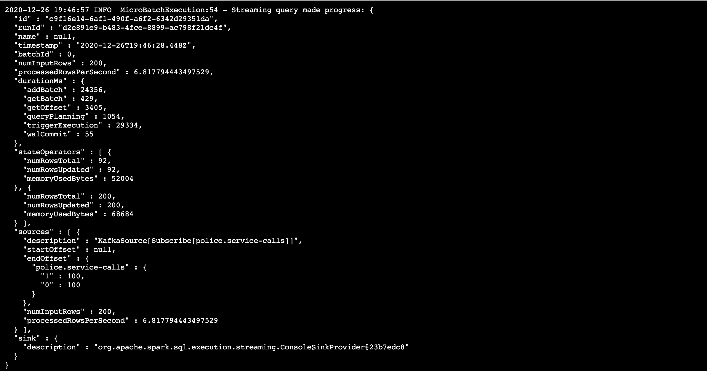
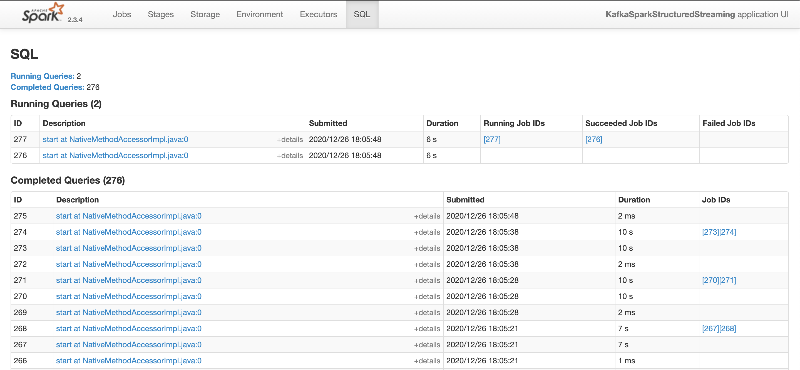

# Data Streaming with Spark and Kafka


### Prerequisites

* A Kafka Cluster
* A Spark Cluster
* A Python environment (run `start.sh` to install the requires packages)

### Data Flow and Stream Processing

1. A python producer is used to stream data from a file, into Kafka. To initialise run `python kafka_server.py`

2. Check that the data is correctly produced.

2a. From consumer console 


<<<<<<< HEAD


2b. Using a python consumer running `python consumer_server.py`


=======


2b. Using a python consumer running `python consumer_server.py`


>>>>>>> 3ba1c08003f9a9a602a68fd1a2053ce581cf9da3


3. Data is consumed and processed in streaming fashion in Spark. An aggregate is performed on the stream. This processing can be started by running `data_stream.py` by executing the following command 
```
spark-submit --packages org.apache.spark:spark-sql-kafka-0-10_2.11:2.3.4 --master local[*] data_stream.py
```

The progress reporter:
<<<<<<< HEAD


The stream dumped to console:


The Spark UI:

=======


The stream dumped to console:


The Spark UI:

>>>>>>> 3ba1c08003f9a9a602a68fd1a2053ce581cf9da3


### Spark Parameters

This dataset is small and the infrastructure is run on a local machine, so benchmarking is not applicable. 
Generally, there are two principles to consider:

* Reducing batch processing time by efficiently using resources.

* Selecting appropriate batch size so that the batches are processed as fast as they are received.


1. How do SparkSession property parameters affect the throughput and latency of the data?

Throughput can be measured by looking at `processedRowsPerSecond`. Some parameters that affected this metric included:

* spark.executor.memory 
* spark.executor.cores  
* spark.driver.memory 
* spark.default.parallelism 
* spark.streaming.kafka.maxRatePerPartition 


2. What are the most efficient SparkSession property key/value pairs? 

Defining efficient when the metric `processedRowsPerSecond` is maximised. Some parameters that seemed to work best for this use-case: 


* spark.default.parallelism : 4 - run locally this parameter determines the number of cores
* spark.streaming.kafka.maxRatePerPartition : 10


